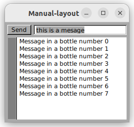
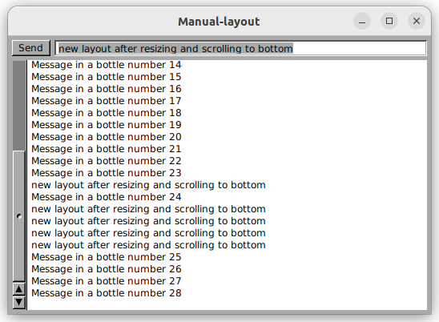

# Manual Layout

In this example, the log view with an attached "Send" button and text area is arranged manually.  The window initially looks like this.  A background timer is also sending messages to the log window.

After resizing the window and typing some messages into the text area and pressing the "Send" button, the new layout looks like this.

This all seems ok.

