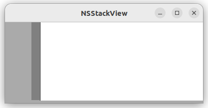

# Use of NSStackView

In this example, we would like to replace `GSHbox` and `GSVbox` with an `NSStackView`.  We want to programmatically construct all widgets and layout.

The code compiles fine.  I do not see any views rendered in the window.

