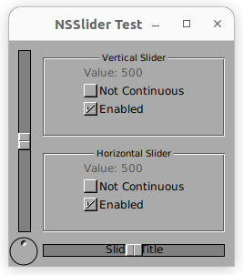

# GNUstep Row and Column Layout Examples

This project demonstrates some techniques and possible issues when creating layouts completely programmatically.  We wanted to create a simple window app without using GORM and in the process explored different ways of lining things up in rows and columns.

By looking at some example tests, we found `GSHbox` and `GSVbox` which do exactly what we want.  We found that these do not play well with code compiled with `-fobjc-arc`.

We wanted to explore the use of `NSStackView`, but got could not get very far with that.

## Technique

The demonstrations here all create a little "Log Viewer" widget with a scroll bar and text area for entering new log messages.  There is also a background timer sending new messsages to the Log.  A user should be able to add new messages by pressing the "Send" button.  The window should be able to be resized, and should have a minimum size.

In examples `20-gsvbox-compile-error`, `30-gsvbox-with-decls` and `40-stack-view` the previous functionality is augmented with a "Clear" button to clear the log.  The button is placed in an HBOX and is arranged with the Log Viewer in a VBOX to demonstrate some simple layout.  Each of these currently demonstrates some sort of limitation.

We also investigated `NSGridView`, but didn't get very far with that.

## The Hope

The hope is that by sharing these, the sub-projects with the limitations can be investigated, and workarounds can be shared!

## The sub-projects

* [10-manual-layout](10-manual-layout) - A view with a Button, a TextBox and Scrolling TextView.  Completely manual layout put in a window.  Works fine.

* [20-gsvbox-compile-error](20-gsvbox-compile-error) - This was inspired by `NSSlider Test` in https://github.com/gnustep/tests-examples.  It showed the use of GSVbox and GSHbox for simple row and column layout.  This technique seems fine.  However, it does not compile well with ARC.

* [30-gsvbox-with-decls](30-gsvbox-with-decls) - This variation hides the implementation of GSVbox and GSTable by creating a local declaration of just the methods needed.  This seems to make GSVbox and GSHbox usable with ARC.

* [40-stack-view](40-stack-view) - This variation aims to be a more modern implementation of the rows and columns using NSStackView.  It does not currently seem that NSStackView can be initialized and used programmatically.

